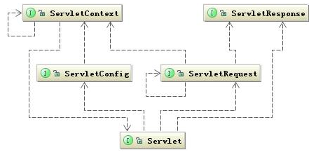

- servlet 容器
- Servlet体系结构

<!-- more -->

## servlet容器

常见的Servlet容器是tomcat，jetty等

### tomcat容器模型


tomcat容器分为四个等级，真正管理servlet的容器是Context容器，一个Context对应一个web工程

### tomcat添加一个web项目

```java
  public Context addWebapp(Host host, String url, String path) {
        //silence(url);
        Context ctx = new StandardContext();
        ctx.setPath( url );//设置访问路径
        ctx.setDocBase(path);//设置项目路径
        ctx.setRealm(new NullRealm());//设置权限
        ctx.addLifecycleListener(new Tomcat.DefaultWebXmlListener());
        ContextConfig ctxCfg = new ContextConfig();
        ctx.addLifecycleListener(ctxCfg);
        ctxCfg.setDefaultWebXml("org/apache/catalin/startup/NO_DEFAULT_XML");
        host.addChild(ctx);//添加到host父容器中
        return ctx;
    }
```

### tomcat 启动

#### 容器初始化

#### 应用初始化

1. 主要是解析web.xml文件，解析文件中的属性保存到WebXML对象中，
2. 然后将WebXML对象中的属性设置到Context中，这里包括Servlet，filter,listener等
3. Servlet将被包装成Context容器中的StandardWrapper，其具有容器的特征，转换将使得开发者不需要强耦合tomcat

#### 创建servlet实例

1. 创建Servlet对象

   如果Servlet的load-on-startup配置项大于0，那么context容器启动的时候就会被实例化，例如DefaultServlet和JSPServlet

   调用wrapper.loadServlet方法：获取servletclasss交给instanceManager去创建一个机遇servletclass.class对象

2. 初始化Servlet

   调用servlet的init方法，同时把包装了Standandwrapper对象de standardwrapperfacade作为servletconfig传给Servlet

## Servlet体系结构

### servlet	

​	Servlet 的运行模式是一个典型的“握手型的交互式”运行模式。所谓“握手型的交互式”就是两个模块为了交换数据通常都会准备一个交易场景，这个场景一直跟随个这个交易过程直到这个交易完成为止。这个交易场景的初始化是根据这次交易对象指定的参数来定制的，这些指定参数通常就会是一个配置类。所以对号入座，交易场景就由 ServletContext 来描述，而定制的参数集合就由 ServletConfig 来描述。而 ServletRequest 和 ServletResponse 就是要交互的具体对象了，它们通常都是作为运输工具来传递交互结果。 



- 与servlet主动关联的三个类：Servletconfig、servletRequest和ServletResponse,这三个类都是通过容器传递给Servlet的。servletconfig是在servlet是Serevlet初始化时候 传递，后两个是请求到达的时候传递过来的。
  - Servletconfig接口声明的方法是为了获取Servlet的一些配置信息，包括servletcontext
  - ServletRequest和ServletResponse是请求响应使用,由tomcat将请求封装为org.apache.coyote.Request ，交给一个用户线程处理请求会创建org.apache.catalina.connector. Request ，穿越整个Servlet容器直到传给Servlet，传递给的是request的门面类requestfacade

### servletconfig


- standardwrapper和standardwrapperfacade都实现了servletconfig接口，而standwrapperfacade是门面类，传递给servlet,这个类能够保证从 StandardWrapper 中拿到 ServletConfig 所规定的数据，而又不把 ServletConfig 不关心的数据暴露给 Servlet
- servletconfg 湖区servletcontext的实际对象是ApplicationContextFacade对象，对容器数据的封装

## 参考文献

Servlet 工作原理解析

https://www.ibm.com/developerworks/cn/java/j-lo-servlet/index.html